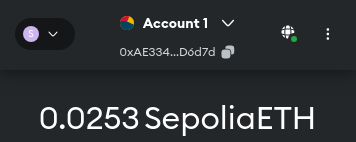

-   You will need a [MetaMask](https://chromewebstore.google.com/detail/metamask/nkbihfbeogaeaoehlefnkodbefgpgknn) wallet.
-   To test the bonus, you will need 4 accounts.
-   Transactions require SepoliaETH. You can get some at https://sepolia-faucet.pk910.de/.
-   Visit https://remix.ethereum.org/
-   Connect all 4 MetaMask accounts to https://remix.ethereum.org/.

-   Select OpenZeppelin's ERC20 template
-   Remove `scripts` and `tests` folders
-   Copy code from `code/OogaBooga42.sol`
